<p align="center"></p>

<p align="center">

<a href="https://github.com/plank/siren/actions?query=workflow%3Arun-tests"></a>
<a href="https://codeclimate.com/github/plank/siren/test_coverage"></a>
<a href="https://codeclimate.com/github/plank/siren/maintainability"></a>
</p>

# Siren

Build mermaid.js diagrams using php.

## Contents

- [Support](#support)
- [Installation](#installation)
- [Flowchart](#flowchart)
  - [Direction](#direction)
  - [Node](#node)
    - [Shape](#shape)
  - [Link](#link)
    - [Text](#text)
    - [Line](#line)
    - [Arrow](#arrow)
    - [Minimum Length](#minimum-length)
  - [Subgraph](#subgraph)
- [Class Diagram](#class-diagram)
  - [Class Diagram Stuff](#class-diagram-stuff)
- [Entitiy Relationship Diagram](#entity-relationship-diagram)
  - [ERD Stuff](#erd-stuff)
- [Testing](#testing)
- [Contributing](#contributing)
- [Security](#security)
- [Credits](#credits)
- [License](#license)

&nbsp;

## Support

This package was developed to support [mermaid.js](https://mermaid.js.org/) 9.3.0. The following diagrams are currently supported.

- [Flowchart](https://mermaid.js.org/syntax/flowchart.html)
- [Class Diagram](https://mermaid.js.org/syntax/classDiagram.html)
- [Entitiy Relationship Diagram](https://mermaid.js.org/syntax/entityRelationshipDiagram.html)

&nbsp;

## Installation

You can install the package via composer:

```bash
composer require plank/siren
```

&nbsp;

## Flowchart

The [mermaid documentation](https://mermaid.js.org/syntax/flowchart.html) describes Flowcharts as:

> All Flowcharts are composed of nodes, the geometric shapes and edges, the arrows or lines. The mermaid code defines the way that these nodes and edges are made and interact.

In Siren, we attempt to use the language of mermaid.js as consitently as possible for building up your Flowcharts.

For example:
```php
$flowchart = Siren::flowchart()
    ->direction(Direction::LEFT_TO_RIGHT)
    ->addNode($a = Node::make('A'))
    ->addNode($b = Node::make('B'))
    ->addNode($c = Node::make('C'))
    ->addLink(Link::make($a, $b))
    ->addLink(Link::make($b, $c))
    ->addLink(Link::make($c, $a));
```

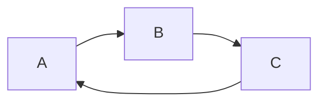

#### Direction

Sets the direction the flowchart flows in. From source to Sink.

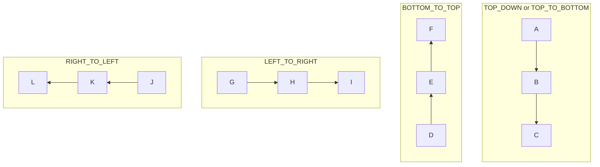

### Node

Class: `\Siren\Builder\Flowchart\Node` 

The `Node`s are the visual elements and you can use a fluent interface to build them up. Nodes are able to display 

```php
$node = Node::make('Node Id')
    ->text('Text including html entities like &cent;')
    ->shape(Shape::SQUARE);
```

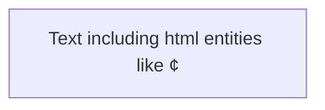

#### Shape

Enum: `\Siren\Builder\Flowchart\Enums\Shape`

Specify the shape of a Node using `shape(Shape $shape)`.

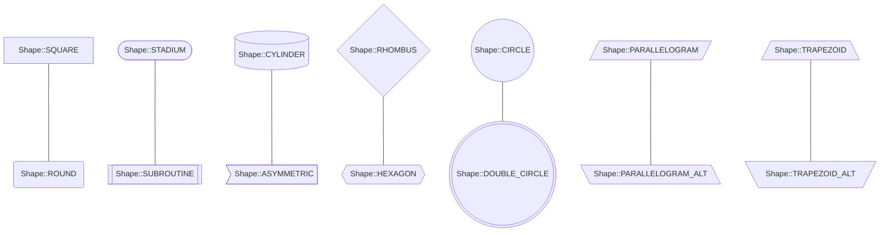

### Link

Class: `\Siren\Builder\Flowchart\Link`

The `Node`s are the visual elements and you can use a fluent interface to build them up.

```php
$link = Link::make($srcNode, $destNode)
    ->text('Text including html entities like &cent;')
    ->line(Line::DOTTED)
    ->arrow(Arrow::DOT)
    ->minimumLength(3);
```

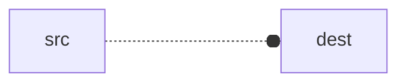

#### Text

You can specify the text to appear on the link using the `text(string $text)` method.

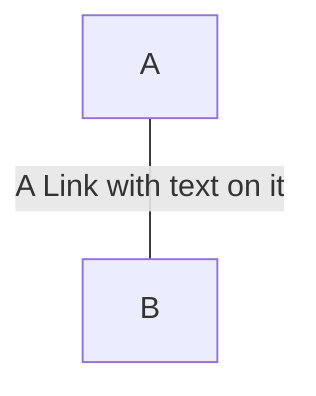

#### Line

Enum: `\Siren\Builder\Flowchart\Enums\Line`

Define the type of line connecting the Nodes using the `line(Line $line)` method.

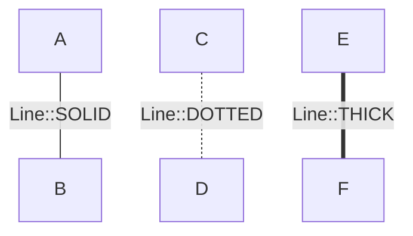

#### Arrow

Enum: `\Siren\Builder\Flowchart\Enums\Arrow`

Specify the arrow on the Link Nodes. Mermaid.js only supports the following configurations:

1. No arrows on either the source Node or destination Node
    - In this situation, you simply do not add any arrows to the `Link`

2. One Arrow on the Destination Node
    - In this situation, you can call `arrow(Arrow $arrow)` on the `Link` to specify the type on the destination Node

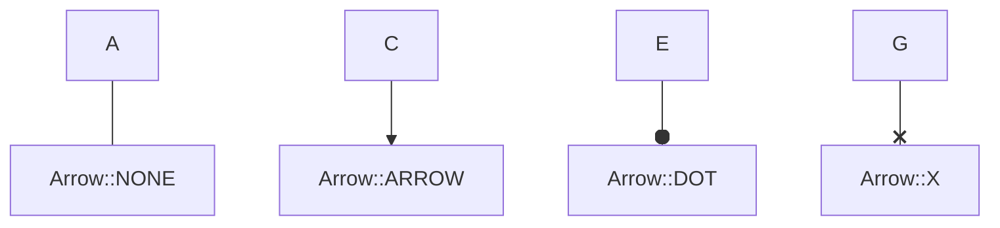

3. The same Arrow on both Nodes
    - In this situation, you can call `multiArrow(Arrow $arrow)` on the `Link` to specify the type on the both the source and destination Nodes

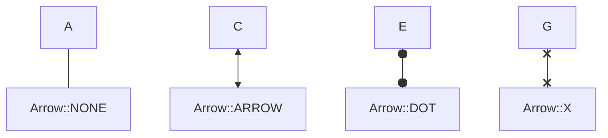

#### Minimum Length

You can set the minimum number of ranks link should span using `minimumLength(int $length)` method.

For example, in the following flowchart the link from A to E has a minimum length of 3, therefore it will span 3 ranks even though E could have been placed on the second rank.
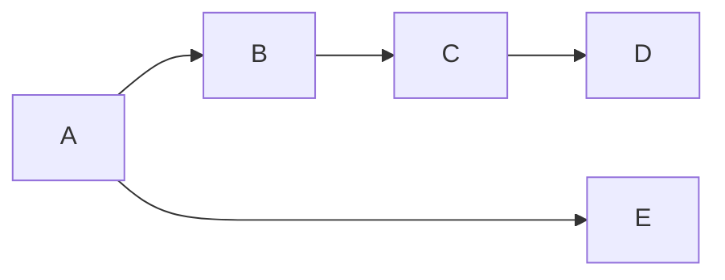

### Subgraph

Flowcharts (also called graphs) can be composed of zero or many `Subgraph`s. Each `Subgraph` functions as its own independent Flowchart, but when combined into a larger graph it also behaves like a node. This means you can `Link` from `Subgraph` to `Subgraph` or `Node` to `Subgraph` or vica-versa. You can also access nodes from anywhere in the entire Flowchart from inside a `Subgraph`.

Simliarly to a `Node`, a `Subgraph` can have a title different from its id by using the `title()` method.

```php
$flowchart = Siren::flowchart()
    ->addSubgraph($sga = Subgraph::make('SGA'))
    ->addSubgraph($sgb = Subgraph::make('SGB')->title('Subgraph Title B'));

$sga->addNode($a = Node::make('A'))
    ->addNode($b = Node::make('B'))
    ->addLink($a, $b)
    ->addLink($b, $a);

$sgb->addNode($c = Node::make('C'))
    ->addNode($d = Node::make('D'))
    ->addLink($c, $d)
    ->addLink($d, $c);

$flowchart->addLink(Link::make($b, $sgb))
    ->addLink(Link::make($c, $sga));
```

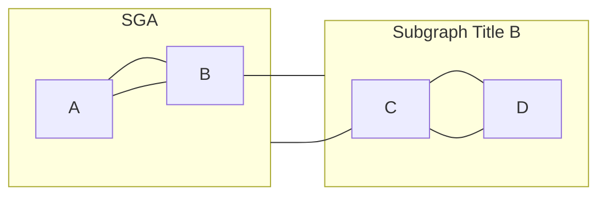

## Class Diagram
### Class Diagram Stuff

## Entitiy Relationship Diagram

> An entity–relationship model (or ER model) describes interrelated things of interest in a specific domain of knowledge. A basic ER model is composed of entity types (which classify the things of interest) and specifies relationships that can exist between entities (instances of those entity types). Wikipedia.

### ERD Stuff

## Usage

Usage.

```php
```

## Testing

```bash
composer test
```

## Contributing

Please see [CONTRIBUTING](CONTRIBUTING.md) for details.

## Credits

- [Kurt Friars](https://github.com/kfriars)
- [All Contributors](../../contributors)

## License

The MIT License (MIT). Please see [License File](LICENSE.md) for more information.

## Security Vulnerabilities

If you discover a security vulnerability within siren, please send an e-mail to security@plankdesign.com. All security vulnerabilities will be promptly addressed.