<p align="center"></p>

# Class Diagram

The [mermaid documentation](https://mermaid.js.org/syntax/flowchart.html) describes Class Diagrams as:

> The class diagram is the main building block of object-oriented modeling. It is used for general conceptual modeling of the structure of the application, and for detailed modeling to translate the models into programming code. Class diagrams can also be used for data modeling. The classes in a class diagram represent both the main elements, interactions in the application, and the classes to be programmed.

In Siren, we attempt to use the language of mermaid.js as consitently as possible for building up your Class Diagrams, with one notable exception — classes are represented as `Symbol`. We have generalized `Symbol` since this package is for PHP and we want `class`, `interface`, `trait` and `enum` to be first class concepts. You still have the possiblity of providing general Annotations too.

For example:

```php
$diagram = Siren::class('Class Diagram')
    ->addSymbol($c = Symbol::class('ClassA'))
    ->addSymbol($i = Symbol::interface('InterfaceA'))
    ->addRelation(Relation::make($c, i)
        ->strength(Strength::DEPENDENCY)
        ->connection($c, Connection::EXTENSION)
    );
```

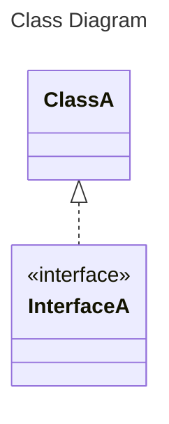

&nbsp;

&nbsp;

## Contents

- [Direction](#direction)
- [Symbol](#symbol)
  - [Modifier](#modifier)
- [Member](#member)
- [Method](#method)
  - [Argument](#argument)
  - [Type](#type)
  - [Visiblity](#visiblity)
  - [Classifier](#classifier)
- [Relation](#relation)
  - [Strength](#strength)
  - [Multiplicity](#multiplicity)
  - [Connection](#connection)
- [Diagram of ClassDiagram](#diagram-of-classdiagram)

&nbsp;

&nbsp;

## Direction

Enum: `\Siren\Builder\ClassDiagram\Enums\Direction`

Sets the direction the Class Diagram flows in.

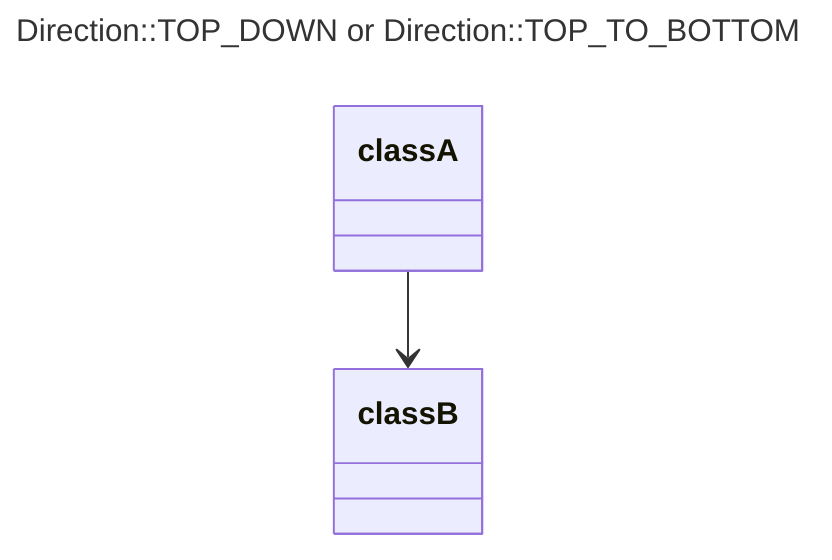

&nbsp;

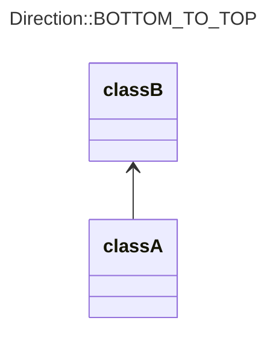

&nbsp;

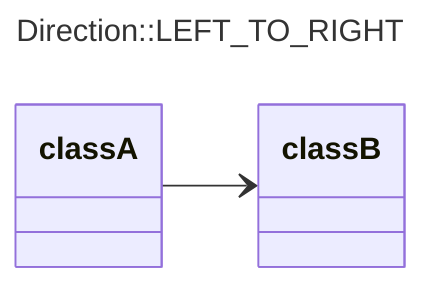

&nbsp;

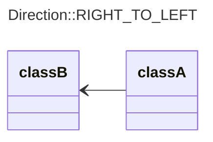

&nbsp;

&nbsp;

## Symbol

Class: `\Siren\Builder\ClassDiagram\Symbol`

The `Symbol`s are the building blocks of the class diagram and are used to define the various object types in the system. The main `Symbol` types are `::class()`, `::interface()`, `::trait()`, `::enum()`, however you can also add any annotation you want to your `::class()`es.

```php
Symbol::trait('HasLions')
    ->addMember(Member::make('pride')->visibility(Visibility::PROTECTED)->type('array<Lion>'))
    ->addMethod(Method::make('addLion')->addArgument('lion', 'Lion'));
```

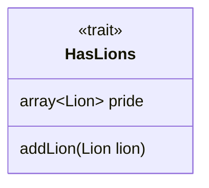

```php
Symbol::class('MailService')
    ->annotation('service')
    ->addMethod(Method::make('send')->addArgument('message', 'Mail'));
```

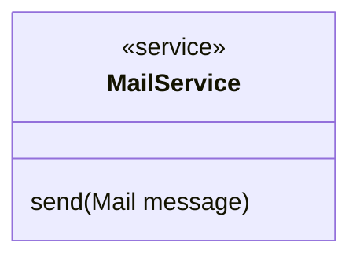

&nbsp;

### Modifier

Enum: `\Siren\Builder\ClassDiagram\Enums\Modifier`

|    Modifier      |
|------------------|
| ABSTRACT         |
| FINAL            |

There are a few variations of the class `Symbol` which can be controlled by passing them to the `class(string name, ?Modifier modifier = null)` method of the `ClassDiagram`. This will simply add the proper annotations.

```php
Siren::class()
    ->addSymbol(Symbol::class('AbstractModel', Modifier::ABSTRACT))
```

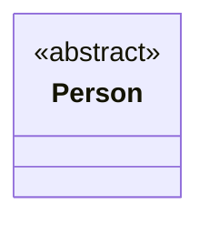

&nbsp;

&nbsp;

## Member

Class: `\Siren\Builder\ClassDiagram\Member`

These are individual items of a `Symbol`'s attribute list. You can add `Member`s to a `Symbol` using its `addMember(Member member)` method.

```php
Member::make('taxRate')
    ->visibility(Visibility::PRIVATE)
    ->classifier(Classifier::STATIC)
    ->type('Percentage')
```

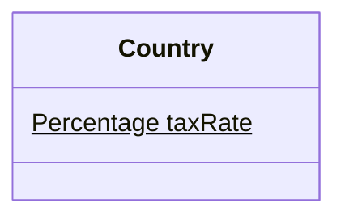

&nbsp;

&nbsp;

## Method

Class: `\Siren\Builder\ClassDiagram\Method`

The functions and methods defined by a `Symbol`. You can add `Method`s to a `Symbol` using its `addMethod(Method method)` method.

```php
Method::make('salesTax')
    ->addArgument(Argument::make('amount', 'Money'))
    ->visibility(Visibility::PUBLIC)
    ->classifier(Classifier::ABSTRACT)
    ->return('Money')
```

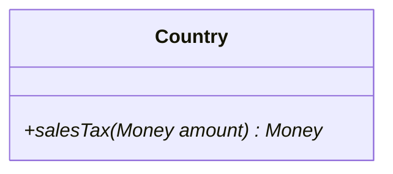

&nbsp;

### Argument

Class: `\Siren\Builder\ClassDiagram\Argument`

`Argument`s define the interface of a `Method`, and can be added using the `addArgument(Argument argument)` method.

```php
Argument::make('name', 'type')
```

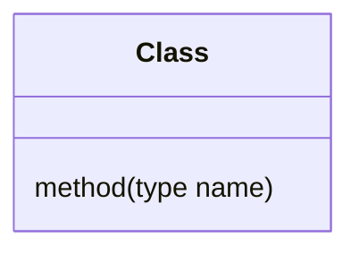

&nbsp;

### Type

Class: `\Siren\Builder\ClassDiagram\Type`

Types are used to define the data type of values in the Diagram. For example return types, argument types or member types. `Type` is abstracted from package consumers, and is handled in methods like `addArgument(string name, string type)`.

&nbsp;

### Visiblity

Enum: `\Siren\Builder\ClassDiagram\Enums\Visibility`

|    Visbility     |
|------------------|
| PUBLIC           |
| PROTECTED        |
| PRIVATE          |
| INTERNAL         |

The visiblity of a `Method` or `Member`. You can add visiblity using the `visibility(Visibility visiblity)` method.

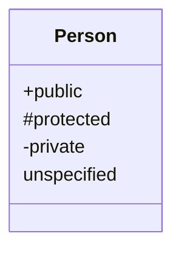

&nbsp;

### Classifier

Enum: `\Siren\Builder\ClassDiagram\Enums\Classifier`

|    Classifier    |
|------------------|
| ABSTRACT         |
| STATIC           |

The classifier of a `Method` or `Member`. You can add classifier using the `classifier(Classifier classifier)` method.

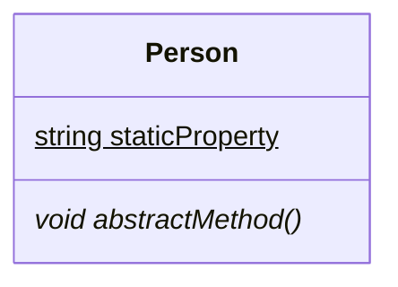

&nbsp;

&nbsp;

## Relation

Class: `\Siren\Builder\ClassDiagram\Relation`

`Relation`s define the connections between the `Symbol`s of the diagram, and express the way in which they are connected.

```php
Siren::class()
    ->addSymbol($a = Symbol::class('ClassA'))
    ->addSymbol($b = Symbol::class('ClassB'))
    ->addRelation(Relation::make($a, b)
            ->name('&copy; Relation')
            ->connection($a, Connection::AGGREGATION)
            ->multiplicity($a, Multiplicity::ONE_TO_N)
            ->strength(Strength::DEPENDENCY));
```

```mermaid
classDiagram
direction LR
class ClassA
class ClassB
ClassA "1..n" o.. ClassB : &copy; Relation
```

&nbsp;

### Strength

Enum: `\Siren\Builder\ClassDiagram\Enums\Strength`

|     Strength     |
|------------------|
| ASSOCIATION      |
| DEPENDENCY       |

The implied stength of the relation between two Symbols.

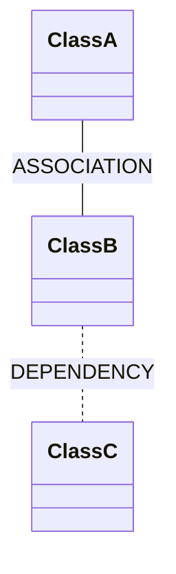

&nbsp;

### Multiplicity

Enum: `\Siren\Builder\ClassDiagram\Enums\Multiplicity`

|   Multiplicity   |
|------------------|
| ONLY_ONE         |
| ZERO_OR_ONE      |
| ONE_OR_MORE      |
| MANY             |
| N                |
| ZERO_TO_N        |
| ONE_TO_N         |

`Multiplicity` defines the number of instance of one `Symbol` that can be attached to another `Symbol`.

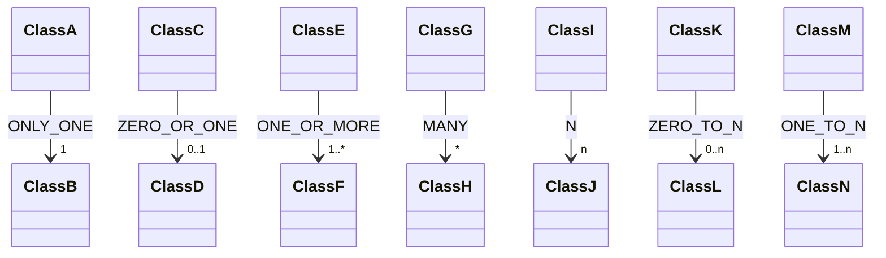

&nbsp;

### Connection

Enum: `\Siren\Builder\ClassDiagram\Enums\Connection`

|    Connection    |
|------------------|
| EXTENSION        |
| DEPENDENCY       |
| COMPOSITION      |
| AGGREGATION      |

`Connection` defines the nature of the relationship between the two `Symbol`s.

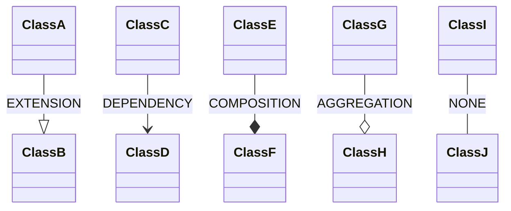

&nbsp;

&nbsp;

## Diagram of ClassDiagram

And here is a mermaid.js Class Diagram, of Siren's ClassDiagram generator.

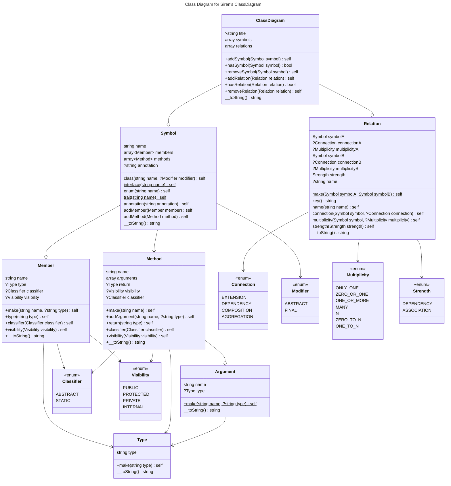