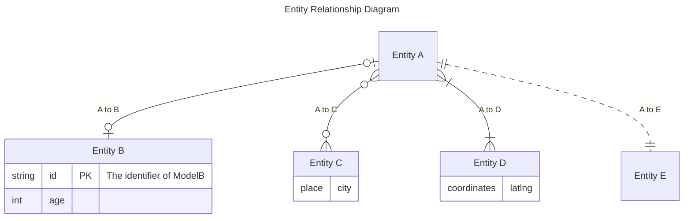
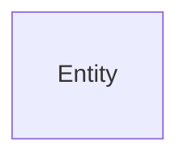
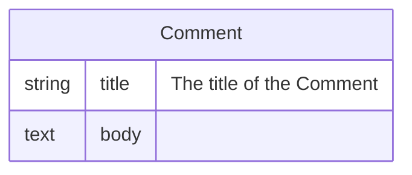
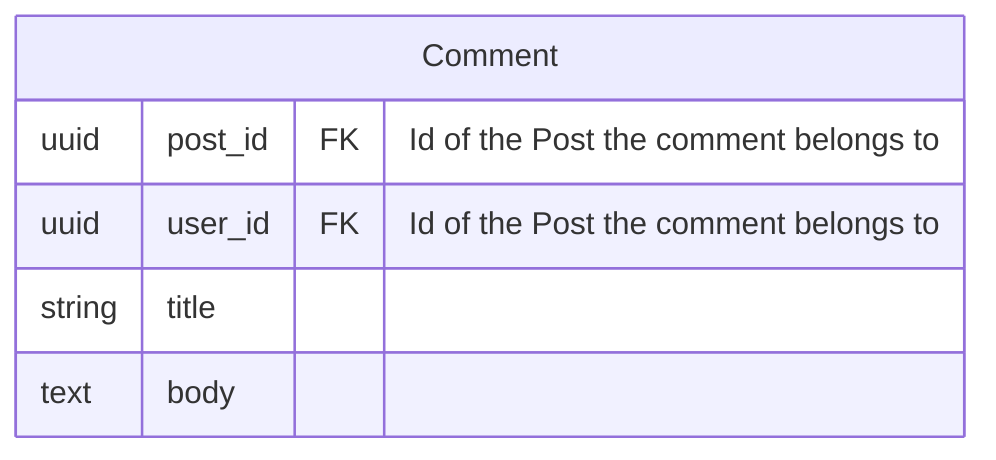
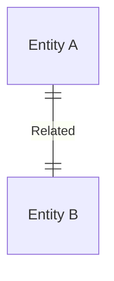
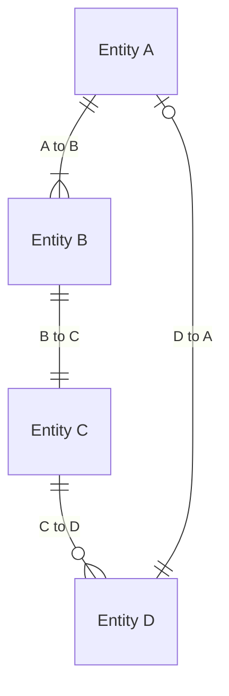
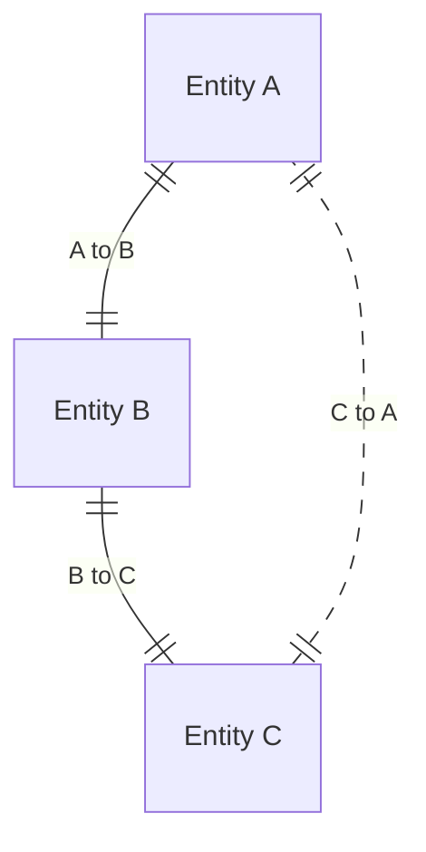

<p align="center"></p>

# Entity Relationship Diagram

The [mermaid documentation](https://mermaid.js.org/syntax/entityRelationshipDiagram.html) describes Entity Relationship Diagrams as:

> An entity–relationship model (or ER model) describes interrelated things of interest in a specific domain of knowledge. A basic ER model is composed of entity types (which classify the things of interest) and specifies relationships that can exist between entities (instances of those entity types). Wikipedia.


In Siren, we attempt to use the language of mermaid.js as consitently as possible for building up your Entity Relationship Diagrams.

For example:

```php
$diagram = Siren::erd('Entity Relationship Diagram')
    ->addEntity($a = Entity::make('Entity A'))
    ->addEntity($b = Entity::make('Entity B')
        ->addAttribute(Attribute::make('id', 'string')
            ->comment('The identifier of ModelB')
            ->key(Key::PRIMARY)
        )->addAttribute(Attribute::make('age', 'int'))
    )
    ->addEntity($c = Entity::make('Entity C')
        ->addAttribute(Attribute::make('city', 'place'))
    )->addEntity($d = Entity::make('Entity D')
        ->addAttribute(Attribute::make('latlng', 'coordinates'))
    )->addEntity($e = Entity::make('Entity E'))
    ->addRelation(Relation::make('A to B', $a, $b)
        ->cardinality($a, Cardinality::ZERO_OR_ONE)
        ->cardinality($b, Cardinality::ZERO_OR_ONE))
    ->addRelation(Relation::make('A to C', $a, $c)
        ->cardinality($a, Cardinality::ZERO_OR_MORE)
        ->cardinality($c, Cardinality::ZERO_OR_MORE))
    ->addRelation(Relation::make('A to D', $a, $d)
        ->cardinality($a, Cardinality::ONE_OR_MORE)
        ->cardinality($d, Cardinality::ONE_OR_MORE)
        ->identifying())
    ->addRelation(Relation::make('A to E', $a, $e)->nonIdentifying());
```



&nbsp;

&nbsp;

## Contents

- [Entity](#entity)
  - [Attribute](#attribute)
  - [Key](#key)
- [Relation](#relation)
  - [Cardinality](#cardinality)
  - [Identification](#identification)

&nbsp;

&nbsp;

## Entity

Class: `Plank\Siren\Builders\EntityRelationshipDiagram\Entity`

`Entity`s are the way we classify the things of interest in the domain.

```php
Entity::make('Entity');
```



&nbsp;

### Attribute

Class: `Plank\Siren\Builders\EntityRelationshipDiagram\Attribute`

`Attribute`s are characteristics or properties of an `Entity`. They are used to describe the different features and characteristics of an `Entity`. When representing relational table structures, the attributes will often include the keys and indexes of the `Entity`.

You can also provide extra context to your `Attribute`s by providing a comment using the `comment(string $comment)` method.

```php
Entity::make('Comment')
    ->addAttribute(Attribute::make('title', 'string')->comment('The title of the Comment'))
    ->addAttribute(Attribute::make('body', 'text'));
```



&nbsp;

### Key

Enum: `Plank\Siren\Builders\EntityRelationshipDiagram\Enums\Key`

|    Key    |
|-----------|
| PRIMARY   |
| FOREIGN   |

When representing relational table structures, you can define if an `Attribute` is a foreign or primary key.

```php
Entity::make('Comment')
    ->addAttribute(Attribute::make('post_id', 'uuid')
        ->comment('Id of the Post the comment belongs to')
        ->key(Key::FOREIGN))
    ->addAttribute(Attribute::make('user_id', 'uuid')
        ->comment('Id of the User who wrote the comment')
        ->key(Key::FOREIGN))
    ->addAttribute(Attribute::make('title', 'string'))
    ->addAttribute(Attribute::make('body', 'text'));
```



&nbsp;

&nbsp;

## Relation

Class: `Plank\Siren\Builders\EntityRelationshipDiagram\Relation`

A `Relation` is the association or connection of two `Entity`s.

```php
$diagram = Siren::erd()
    ->addEntity($a = Entity::make('Entity A'))
    ->addEntity($b = Entity::make('Entity B'))
    ->addRelation(Relation::make('Related', $a, $b));
```



&nbsp;

### Cardinality

Enum: `Plank\Siren\Builders\EntityRelationshipDiagram\Enums\Cardinality`

|   Cardinality   |
|-----------------|
| ZERO_OR_ONE     |
| ZERO_OR_MORE    |
| ONE_OR_MORE     |
| ONLY_ONE        |

`Cardinality` describes the number of instances of one `Entity` that can be associated with another `Entity`.

```php
$diagram = Siren::erd()
    ->addEntity($a = Entity::make('Entity A'))
    ->addEntity($b = Entity::make('Entity B'))
    ->addEntity($c = Entity::make('Entity C'))
    ->addEntity($d = Entity::make('Entity D'))
    ->addRelation(Relation::make('A to B', $a, $b)->cardinality($b, Cardinality::ONE_OR_MORE))
    ->addRelation(Relation::make('B to C', $b, $c)->cardinality($c, Cardinality::ONLY_ONE))
    ->addRelation(Relation::make('C to D', $c, $d)->cardinality($d, Cardinality::ZERO_OR_MORE))
    ->addRelation(Relation::make('D to A', $d, $a)->cardinality($a, Cardinality::ZERO_OR_ONE));
```



&nbsp;

### Identification

Enum: `Plank\Siren\Builders\EntityRelationshipDiagram\Enums\Identification`

|   Identification   |
|--------------------|
| NON_IDENTIFYING    |
| IDENTIFYING        |

`Identification` describes the type of relationship between `Entity`s, where the existence of one entity depends on the existence of another entity. In an identifying relationship, one `Entity` is uniquely identified by the other `Entity`, which means that the first `Entity` cannot exist without the second `Entity`.

```php
$diagram = Siren::erd()
    ->addEntity($a = Entity::make('Entity A'))
    ->addEntity($b = Entity::make('Entity B'))
    ->addEntity($c = Entity::make('Entity C'))
    ->addRelation(Relation::make('A to B', $a, $b))
    ->addRelation(Relation::make('B to C', $b, $c)->identification(Identification::IDENTIFYING))
    ->addRelation(Relation::make('C to A', $c, $a)->identification(Identification::NON_IDENTIFYING));
```


