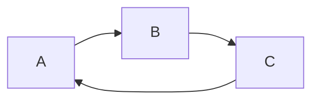
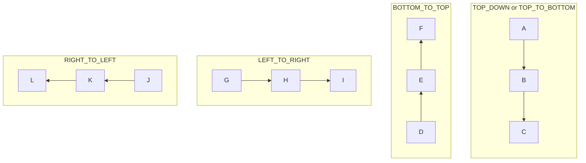
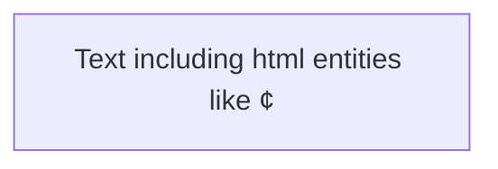
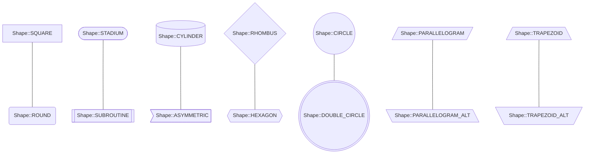
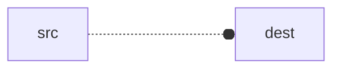
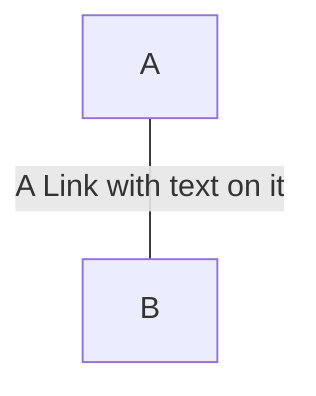
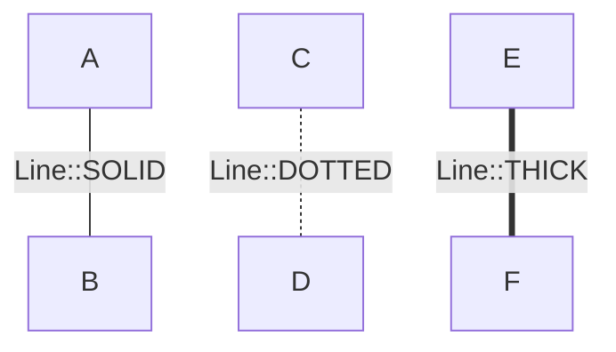
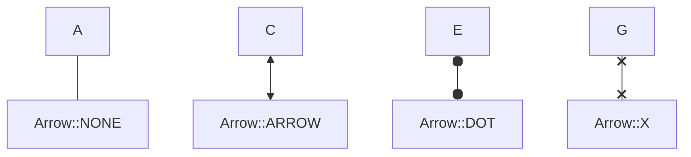
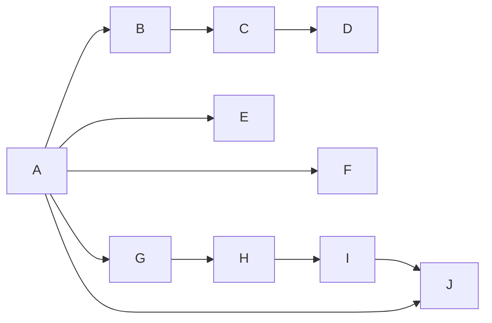
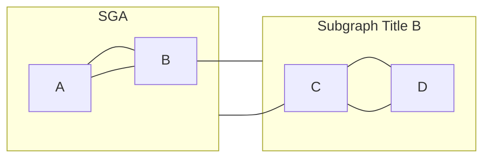

<p align="center"></p>

# Flowchart

The [mermaid documentation](https://mermaid.js.org/syntax/flowchart.html) describes Flowcharts as:

> All Flowcharts are composed of nodes, the geometric shapes and edges, the arrows or lines. The mermaid code defines the way that these nodes and edges are made and interact.

In Siren, we attempt to use the language of mermaid.js as consitently as possible for building up your Flowcharts.

For example:

```php
$flowchart = Siren::flowchart()
    ->direction(Direction::LEFT_TO_RIGHT)
    ->addNode($a = Node::make('A'))
    ->addNode($b = Node::make('B'))
    ->addNode($c = Node::make('C'))
    ->addLink(Link::make($a, $b))
    ->addLink(Link::make($b, $c))
    ->addLink(Link::make($c, $a));
```



&nbsp;

&nbsp;

## Contents

- [Direction](#direction)
- [Node](#node)
  - [Shape](#shape)
- [Link](#link)
  - [Text](#text)
  - [Line](#line)
  - [Arrow](#arrow)
  - [Span](#span)
- [Subgraph](#subgraph)

&nbsp;

&nbsp;

## Direction

Sets the direction the Flowchart flows in.



&nbsp;

&nbsp;

## Node

Class: `\Siren\Builder\Flowchart\Node` 

The `Node`s are the building blocks you can use to build a flowchart.

```php
$node = Node::make('NodeId')
    ->text('Text including html entities like &cent;')
    ->shape(Shape::SQUARE);
```



&nbsp;

### Shape

Enum: `\Siren\Builder\Flowchart\Enums\Shape`

Specify the shape of a Node using `shape(Shape $shape)`.



&nbsp;

&nbsp;

## Link

Class: `\Siren\Builder\Flowchart\Link`

The `Link`s are the visual elements used to connect nodes together.

```php
$link = Link::make($srcNode, $destNode)
    ->text('Text including html entities like &cent;')
    ->line(Line::DOTTED)
    ->arrow(Arrow::DOT)
    ->span(3);
```



&nbsp;

### Text

You can specify the text which appears on a `Link` using the `text(string $text)` method.



&nbsp;

### Line

Enum: `\Siren\Builder\Flowchart\Enums\Line`

Define the type of line connecting the Nodes using the `Link`'s `line(Line $line)` method.



&nbsp;

### Arrow

Enum: `\Siren\Builder\Flowchart\Enums\Arrow`

Specify the arrow on the Link Nodes. Mermaid.js only supports the following configurations:

1. No arrows on either the source Node or destination Node
    - In this situation, you simply do not add any arrows to the `Link`

2. One Arrow on the Destination Node
    - In this situation, you can call `arrow(Arrow $arrow)` on the `Link` to specify the type on the destination Node

    ```mermaid
    flowchart TD
    A --- Arrow::NONE
    C --> Arrow::ARROW
    E --o Arrow::DOT
    G --x Arrow::X
    ```

3. The same Arrow on both Nodes
    - In this situation, you can call `multiArrow(Arrow $arrow)` on the `Link` to specify the type on the both the source and destination Nodes



&nbsp;

### Span

You can set the minimum number of ranks the `Link` should span using `span(int $length)` method.

For example in the following Flowchart, the link from A to E will at a minimum span 1 rank, even though E could have been placed on the second rank. And even though we specified J to have a minimum span of 2, because it is only a minimum, you can see the other connections to J, make the `Link` actually span 3 ranks.



&nbsp;

&nbsp;

## Subgraph

Flowcharts (also called graphs) can be composed of zero or many `Subgraph`s. Each `Subgraph` functions as its own independent Flowchart, but when combined into a larger graph it also behaves like a node. This means you can `Link` from `Subgraph` to `Subgraph` or `Node` to `Subgraph` or vica-versa. You can also access nodes from anywhere in the entire Flowchart from inside a `Subgraph`.

Simliarly to a `Node`, a `Subgraph` can have a title different from its id by using the `title()` method.

```php
$flowchart = Siren::graph()
    ->addSubgraph($sga = Subgraph::make('SGA'))
    ->addSubgraph($sgb = Subgraph::make('SGB')->title('Subgraph Title B'));

$sga->addNode($a = Node::make('A'))
    ->addNode($b = Node::make('B'))
    ->addLink($a, $b)
    ->addLink($b, $a);

$sgb->addNode($c = Node::make('C'))
    ->addNode($d = Node::make('D'))
    ->addLink($c, $d)
    ->addLink($d, $c);

$flowchart->addLink(Link::make($b, $sgb))
    ->addLink(Link::make($c, $sga));
```


